# FleshRing Plugin Documentation

> **Version:** 1.0.0
> **Engine Compatibility:** Unreal Engine 5.7
> **Last Updated:** 2026-02-01

---

## Table of Contents

1. [Overview](#overview)
2. [Getting Started (5-Minute Quick Start)](#getting-started)
3. [Core Features](#core-features)
4. [Material Layer System](#material-layer-system)
5. [Parameter Reference](#parameter-reference)
6. [Asset Editor Guide](#asset-editor-guide)
7. [Blueprint & C++ API](#blueprint--c-api)
8. [Performance Guide](#performance-guide)
9. [Troubleshooting & FAQ](#troubleshooting--faq)
10. [Support & Contact](#support--contact)
11. [License](#license)
12. [Credits](#credits)

---

## Overview

**FleshRing** is a GPU-accelerated mesh deformation plugin that simulates realistic flesh compression effects in real-time. Using Compute Shaders and Signed Distance Fields (SDF), it creates believable skin deformation when tight objects—such as bands, straps, garters, or stockings—press against character meshes.

### Key Value Propositions

| Feature | Benefit |
|---------|---------|
| **Bake-Based Workflow** | Zero runtime GPU cost—design in editor, deploy optimized |
| **SDF-Driven Accuracy** | Precise compression matching actual ring mesh shape |
| **Full GPU Pipeline** | Multi-stage Compute Shader pipeline for production-quality results |
| **Advanced Smoothing** | Laplacian, Taubin, PBD constraints for artifact-free results |
| **Material Layer Control** | Per-material deformation inclusion/exclusion via layer masking |
| **Modular Character Support** | Works with UE modular skeletal mesh systems |
| **Real-time Editor Preview** | Instant GPU-powered feedback while editing |
| **Dedicated Asset Editor** | 3D viewport, transform gizmos, skeleton bone tree browser |

### Ideal Use Cases
- Character customization systems with tight accessories
- Fashion/clothing visuals (stockings, garters, corsets, belts)
- Stylized characters requiring exaggerated flesh effects
- Static flesh compression effects around rings/bands
  

---

## Getting Started

**Goal:** See your first deformation result within 5 minutes.

### System Requirements

| Requirement | Specification |
|-------------|---------------|
| Engine | Unreal Engine 5.7 |
| Platform | Windows 64-bit (Win64) |
| GPU | Compute Shader support (SM 5.0+, any modern GPU) |
| RAM | No additional requirements beyond standard UE projects |

### Installation Steps

1. **Locate** your project's root folder (where `YourProject.uproject` is located)

2. **Create** a `Plugins` folder if it doesn't already exist

3. **Copy** the `FleshRingPlugin` folder into `Plugins/`

   ```
   YourProject/
   ├── YourProject.uproject
   └── Plugins/
       └── FleshRingPlugin/
           ├── FleshRingPlugin.uplugin
           ├── Source/
           └── Shaders/
   ```

4. **Launch** Unreal Editor and open your project

5. **Enable** the plugin: `Edit → Plugins → Search "FleshRing" → Enable`

6. **Restart** the editor when prompted

7. **Verify**: In Content Browser, right-click → **Miscellaneous** → confirm **"FleshRing Asset"** appears

### Quick Start (5-Minute Workflow)

| Step | Action |
|------|--------|
| **1** | Right-click Content Browser → `Miscellaneous → FleshRing Asset` |
| **2** | Double-click the new asset to open **FleshRing Asset Editor** |
| **3** | In Details panel → **Target** category → set **Target Skeletal Mesh** |
| **4** | In Skeleton Tree panel → right-click a bone → `Add Ring to [BoneName]` |
| **5** | In Details panel → **Ring** category → set **Ring Mesh** (or use Virtual Ring/Band mode) |
| **6** | In Details panel → **Ring** category → adjust **Tightness Strength** (try 0.5~1.0) |
| **7** | In Toolbar → click **"Bake"** button (critical!) |
| **8** | Add `UFleshRingComponent` to your character Blueprint → set **Flesh Ring Asset** |

> **Critical:** Step 7 (Bake) is mandatory. Without baking, deformations visible in the editor will NOT appear at runtime. The baked mesh is stored inside the FleshRing Asset.

> **Is baking destructive?** No. Baking generates a NEW skeletal mesh (`BakedMesh`) and does NOT modify your original `TargetSkeletalMesh`. You can rebake anytime without affecting source meshes.

**[Step 1 - Create Asset]**

 

**[Step 3 - Set Target]**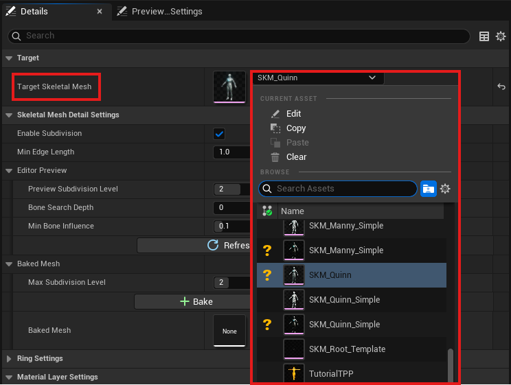

**[Step 4 - Add Ring]**


**[Step 7 - Bake]**

**[Step 8 - Component Setup]**

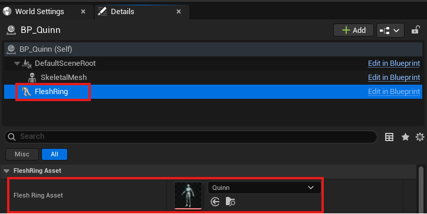

---

## Core Features

### How It Works

FleshRing uses a **bake-based workflow**:

1. **Editor** — Real-time GPU preview using Compute Shaders (Tightness → Bulge → Smoothing → Normals)
2. **Bake** — Deformation "freezes" into mesh geometry, stored in FleshRing Asset
3. **Runtime** — Standard UE skeletal animation on pre-deformed mesh (**zero FleshRing GPU cost**)

### Feature Deep-Dive

#### 1. Influence Calculation (3 Modes)

FleshRing supports 3 influence modes, each using different distance calculation algorithms on GPU Compute Shaders.

##### Mesh Based (SDF)

**Precise compression matching actual Ring mesh shape**

*SDF Generation:*
- **Point-to-Triangle Distance**: Calculates shortest distance from each voxel to all mesh triangles
- **12-Ray Sign Detection**: Icosahedron-based uniform ray distribution with majority voting for inside/outside
- **Donut Hole Correction**: 2D Slice Flood Fill auto-detects inner holes

*SDF Sampling (Tightness):*
- **Ray-AABB Intersection**: Finds entry point when vertex is outside SDF bounds
- **Coarse Raymarching**: Up to 47 iterations to approach surface
- **Binary Search Refinement**: 4 iterations for sub-voxel precision (1/16 error)
- **OBB Optimization**: Oriented Bounding Box minimizes sampling range

**Best for**: Complex decorative bands, asymmetric garters, any arbitrary shape

##### Virtual Ring (Simple Cylinder)

**No separate ring mesh needed — parameter-based cylindrical influence**

- **Distance Calculation**: Decompose vertex into Ring axis coordinates
  - `AxisDist` = distance along ring axis
  - `RadialDist` = perpendicular distance from axis
- **Influence**: `RadialInfluence × AxialInfluence` with configurable Falloff curves

**Best for**: Skeletal meshes with pre-attached rings, simple cylindrical bands

##### Virtual Band (Variable Radius for Stockings)

**Height-dependent radius using Catmull-Rom Spline**

- **4 Control Points**: `LowerRadius → MidLowerRadius → MidUpperRadius → UpperRadius`
- **Smooth Interpolation**: Cubic Catmull-Rom spline creates natural curves
- **Upper/Lower Bulge Zones**: Independent radius control for realistic stocking tops

**Best for**: Stocking tops, high socks, arm bands with varying compression

##### Mode Selection Guide

| Scenario | Recommended Mode | Reason |
|----------|-----------------|--------|
| Decorative garter, lace band | **Mesh Based** | Accurate mesh shape reproduction |
| Ring mesh already integrated into skeletal mesh | **Virtual Ring** | No separate mesh needed, parameter-based control |
| Simple cylindrical band | **Virtual Ring** | Instant parameter adjustment |
| Stocking top, high sock | **Virtual Band** | Height-dependent curvature |

#### 2. Tightness Effect
Simulates compression by pulling vertices toward the Ring's influence center.
- Configurable strength and radius
- Multiple falloff curves: Linear, Quadratic, Hermite (default)
- Bone distance ratio preservation option


#### 3. Bulge Effect
Creates realistic flesh displacement around compressed areas—the "muffin top" effect.
- Automatic or manual direction detection
- Falloff types: Linear, Quadratic, Hermite, WendlandC2 (default), Smootherstep
- Independent axial and radial range control
- Direction bias: Radial/Axial blend ratio (default 0.7 = 70% outward, 30% up/down)


#### 4. Laplacian Smoothing
Removes harsh deformation artifacts using topology-aware smoothing.
- **Standard Laplacian:** Fast smoothing (may shrink over iterations)
- **Taubin λ-μ:** Volume-preserving smoothing

#### 5. PBD Edge Constraints
Position-Based Dynamics maintains mesh volume by preserving original edge lengths during deformation.

#### 6. Normal & Tangent Recomputation
- **Geometric Mode:** Average of surrounding face normals
- **Surface Rotation Mode:** Rodrigues rotation preserving original smooth normals
- Hop-based blending for seamless boundary transitions
- Gram-Schmidt tangent orthonormalization

#### 7. Mesh Subdivision
Automatically subdivides low-resolution meshes in affected areas for higher deformation quality.
- Configurable subdivision level: 1-4 (preview) / 1-6 (runtime max)
- Edge length-based adaptive subdivision
- Preserves UV coordinates and bone weights

### Modular Character Support

FleshRing provides **runtime ring asset swapping** for modular character systems built with Leader Pose Component / Copy Pose from Mesh or Skeletal Mesh Merge.

#### Key Capabilities

| Feature | Description |
|---------|-------------|
| **Per-Part Ring Swap** | Change ring assets on individual modular parts at runtime |
| **Part Mesh Swap** | Replace modular meshes with automatic ring effect cleanup |

#### Supported Workflows

| Workflow | Ring Swap Cost | Best For |
|----------|---------------|----------|
| **Leader Pose / Copy Pose** | Per-part only | Runtime costume changes, customization UI |
| **Skeletal Merging** | Full rebuild | Static characters, LOD optimization |

**Leader Pose / Copy Pose:** Each part exists as a separate SkeletalMeshComponent. Attach one `FleshRingComponent` per part that needs ring effects. Use `SwapModularRingAsset()` for instant per-part ring swaps, `SwapModularPartMesh()` for mesh changes.

**Skeletal Merging:** Parts merged into single mesh. Build a `TArray<FFleshRingModularPart>` with each part's mesh and optional ring asset, then call `RebuildMergedMesh()`. Requires full rebuild for any change.

#### Requirements

| Requirement | Description |
|-------------|-------------|
| **Same Skeleton** | All modular parts must share the same `USkeleton` asset |
| **BakedMesh** | Ring assets must be baked before runtime use (`Bake` in editor) |

---

## Material Layer System

FleshRing uses a **material-based layer system** to control which parts of the mesh receive deformation. This is the primary mechanism for handling skin/clothing separation.

### Layer Types

| Layer Type | Description | Example |
|------------|-------------|---------|
| **Skin** | Character skin/flesh | Body mesh |
| **Stocking** | Skin-tight clothing | Stockings, tights, body suits |
| **Underwear** | Underwear | Panties, bras, garters |
| **Outerwear** | Outer clothing | Skirts, pants, jackets |
| **Other** | Doesn't fit above categories | Default, general purpose |
| **Exclude** | **Never affected by Tightness** | Eyes, hair, accessories, jewelry |

> **Note:** Layer types are for classification purposes only. They do not enforce actual layer order or depth. Group materials as desired and control them via `Target Material Layers` mask.

### How Layer Control Works

#### Target Material Layers (`AffectedLayerMask`)
Each Ring has a bitmask controlling which layers receive Tightness deformation:

```
Target Material Layers = Skin | Stocking | Underwear | Outerwear | Other
                          ✓       ○           ○           ○         ✓     (default)
```

- **Default:** `Skin | Other` (skin and unclassified materials only)
- **Checked layers:** Vertices with this layer type WILL be deformed
- **Unchecked layers:** Vertices are excluded from Tightness (but may still be smoothed)
- **Exclude type:** ALWAYS excluded, regardless of mask setting

#### Recommended Workflow for Skin + Clothing

When a Ring presses both skin and clothing in the same area:

| Scenario | Recommended Setting | Note |
|----------|---------------------|------|
| Stocking on skin (want both to compress) | Enable both Skin and Stocking in mask | ⚠️ May cause intersection artifacts if vertices overlap |
| Belt over clothing (clothing compresses) | Enable Outerwear only | — |

### Setting Up Material Layers

1. Open FleshRing Asset Editor
2. Navigate to **Material Layer Mappings** section
3. For each material slot in your mesh:
   - Select the appropriate Layer Type from dropdown
   - Use **Exclude** for materials that should never deform (eyes, hair, etc.)

> **Auto-Detection:** When you set a Target Skeletal Mesh, layer types are automatically inferred from material names (e.g., "Skin", "Body" → Skin, "Stocking" → Stocking). Materials that couldn't be classified are set to **Other**.
>
> **Important:** Since **Other** is included in the default `Target Material Layers` mask, unclassified materials will still be deformed. Review the mappings and either assign proper layer types, or uncheck **Other** from the mask if you want precise control.

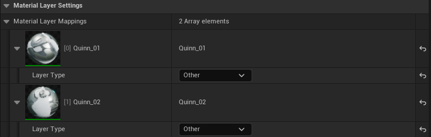

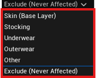

---

## Parameter Reference

Parameters are organized to match the Editor Detail Panel layout.

---

### Target

| UI Label | Property | Type | Default | Range | Description |
|----------|----------|------|---------|-------|-------------|
| Target Skeletal Mesh | `TargetSkeletalMesh` | TSoftObjectPtr | None | — | Target skeletal mesh for this asset |

---

### Skeletal Mesh Detail Settings

| UI Label | Property | Type | Default | Range | Description |
|----------|----------|------|---------|-------|-------------|
| Enable Subdivision | `bEnableSubdivision` | bool | true | — | Enable mesh subdivision |
| Min Edge Length | `MinEdgeLength` | float | 1.0 | 0.1~ | Minimum edge length threshold (cm) - edges shorter than this won't be subdivided |

#### Editor Preview

| UI Label | Property | Type | Default | Range | Description |
|----------|----------|------|---------|-------|-------------|
| Preview Subdivision Level | `PreviewSubdivisionLevel` | int | 2 | 1~4 | Subdivision level for editor preview |
| Bone Search Depth | `PreviewBoneHopCount` | int | 0 | 0~3 | Bone hierarchy search depth for subdivision region (0: target bone only, higher: wider area, more cost) |
| Min Bone Influence | `PreviewBoneWeightThreshold` | float | 0.1 | 0.01~0.7 | Minimum bone weight threshold - higher values narrow subdivision area, improving performance |

#### Baked Mesh

| UI Label | Property | Type | Default | Range | Description |
|----------|----------|------|---------|-------|-------------|
| Max Subdivision Level | `MaxSubdivisionLevel` | int | 2 | 1~6 | Maximum subdivision iterations for baked mesh |

---

### Ring Settings (`FFleshRingSettings`)

#### Basic

| UI Label | Property | Type | Default | Range | Description |
|----------|----------|------|---------|-------|-------------|
| Ring Name | `RingName` | FName | None | — | Custom Ring identifier (auto-generated if empty) |
| Effect Range Mode | `InfluenceMode` | Enum | Mesh Based | — | Mesh Based / Virtual Ring / Virtual Band |
| Bone Name | `BoneName` | FName | None | — | Target bone this Ring attaches to |
| Target Material Layers | `AffectedLayerMask` | Bitmask | Skin \| Other | — | Which material layers receive Tightness |
| Enable Skinned Ring Mesh | `bGenerateSkinnedRingMesh` | bool | true | — | Generate SkeletalMesh version of Ring with bone weights |
| Ring Skin Sampling Radius | `RingSkinSamplingRadius` | float | 2.0 | 0.5~10.0 | Search radius for nearby skin vertices (cm) |

#### Ring

| UI Label | Property | Type | Default | Range | Description |
|----------|----------|------|---------|-------|-------------|
| Ring Mesh | `RingMesh` | UStaticMesh* | None | — | Static mesh to use as Ring shape (used for SDF in Mesh Based mode, visualization in other modes) |

#### Mesh Transform

| UI Label | Property | Type | Default | Range | Description |
|----------|----------|------|---------|-------|-------------|
| Mesh Offset | `MeshOffset` | FVector | (0,0,0) | — | Mesh position offset relative to bone |
| Mesh Rotation | `MeshEulerRotation` | FRotator | (0,-90,0) | — | Mesh rotation (Euler angles) |
| Mesh Scale | `MeshScale` | FVector | (1,1,1) | — | Mesh scale |

> **Note:** Ring Mesh and Mesh Transform are available in all modes. In Mesh Based mode, the mesh defines the SDF shape. In Virtual Ring/Band modes, the mesh is used for visualization while virtual parameters control the actual deformation.

#### Ring Transform (Virtual Ring Mode)

| UI Label | Property | Type | Default | Range | Description |
|----------|----------|------|---------|-------|-------------|
| Ring Radius | `RingRadius` | float | 5.0 | 0.1~100 | Base radius of Ring influence (cm) |
| Ring Thickness | `RingThickness` | float | 1.0 | 0.1~20 | Thickness of Ring band (cm) |
| Ring Height | `RingHeight` | float | 2.0 | 0.1~50 | Height of Ring influence zone (cm) |
| Ring Offset | `RingOffset` | FVector | (0,0,0) | — | Ring position offset relative to bone |
| Ring Rotation | `RingEulerRotation` | FRotator | (0,-90,0) | — | Ring rotation (Euler angles) |

#### Virtual Band (Virtual Band Mode)

| UI Label | Property | Type | Default | Range | Description |
|----------|----------|------|---------|-------|-------------|
| Band Offset | `BandOffset` | FVector | (0,0,0) | — | Position offset from bone |
| Band Rotation | `BandEulerRotation` | FRotator | (0,-90,0) | — | Rotation of the band |
| Band Thickness | `BandThickness` | float | 1.0 | 0.1~10.0 | Band thickness (cm) |

**Mid Band:**

| UI Label | Property | Type | Default | Range | Description |
|----------|----------|------|---------|-------|-------------|
| Band Top Radius | `MidUpperRadius` | float | 8.0 | 0.1~100 | Upper edge radius (cm) |
| Band Bottom Radius | `MidLowerRadius` | float | 8.0 | 0.1~100 | Lower edge radius (cm) |
| Band Height | `BandHeight` | float | 2.0 | 0.1~50 | Band height (cm) |

**Upper Bulge Zone:**

| UI Label | Property | Type | Default | Range | Description |
|----------|----------|------|---------|-------|-------------|
| Radius | `Upper.Radius` | float | 11.0 | 0.1~100 | Upper bulge zone radius (cm) |
| Height | `Upper.Height` | float | 2.0 | 0.1~50 | Upper bulge zone height (cm) |

**Lower Bulge Zone:**

| UI Label | Property | Type | Default | Range | Description |
|----------|----------|------|---------|-------|-------------|
| Radius | `Lower.Radius` | float | 9.0 | 0.1~100 | Lower bulge zone radius (cm) |
| Height | `Lower.Height` | float | 1.0 | 0.1~50 | Lower bulge zone height (cm) |

---

#### Deformation > Tightness

| UI Label | Property | Type | Default | Range | Description |
|----------|----------|------|---------|-------|-------------|
| Tightness Strength | `TightnessStrength` | float | 1.5 | 0.0~3.0 | Compression intensity multiplier |
| Tightness Falloff | `FalloffType` | Enum | Hermite | Linear/Quadratic/Hermite | Distance falloff curve |
| Effect Bounds Expand X | `SDFBoundsExpandX` | float | 1.0 | 0.0~10.0 | Expand SDF bounds in X direction (cm). Mesh Based mode only. |
| Effect Bounds Expand Y | `SDFBoundsExpandY` | float | 1.0 | 0.0~10.0 | Expand SDF bounds in Y direction (cm). Mesh Based mode only. |

#### Deformation > Bulge

| UI Label | Property | Type | Default | Range | Description |
|----------|----------|------|---------|-------|-------------|
| Enable Bulge | `bEnableBulge` | bool | true | — | Master toggle for bulge effect |
| Bulge Direction | `BulgeDirection` | Enum | Auto | Auto/Bidirectional/Positive/Negative | Which direction flesh bulges |
| Bulge Falloff | `BulgeFalloff` | Enum | WendlandC2 | Linear/Quadratic/Hermite/WendlandC2/Smootherstep | Bulge falloff curve |
| Bulge Intensity | `BulgeIntensity` | float | 1.0 | 0.0~100 | Flesh displacement strength |
| Bulge Vertical Spread | `BulgeAxialRange` | float | 5.0 | 1.0~8.0 | Vertical spread (multiplier of Ring height) |
| Bulge Horizontal Spread | `BulgeRadialRange` | float | 1.0 | 1.0~3.0 | Horizontal spread (multiplier of Ring radius) |
| Bulge Horizontal Taper | `BulgeRadialTaper` | float | 0.5 | -1.0~1.0 | Horizontal spread taper (-1: contracts with distance, 0: cylindrical, +1: expands with distance) |
| Upper Bulge Strength | `UpperBulgeStrength` | float | 1.0 | 0.0~2.0 | Upper bulge strength. 0: disabled |
| Lower Bulge Strength | `LowerBulgeStrength` | float | 1.0 | 0.0~2.0 | Lower bulge strength. 0: disabled |
| Bulge Direction Bias | `BulgeRadialRatio` | float | 0.7 | 0.0~1.0 | Bulge direction blend (0: purely axial/vertical, 1: purely radial/outward) |

---

#### Refinement

| UI Label | Property | Type | Default | Range | Description |
|----------|----------|------|---------|-------|-------------|
| Enable Refinement | `bEnableRefinement` | bool | true | — | Master toggle for all refinement passes (Smoothing, PBD, etc.) |

#### Refinement > Smoothing Volume

| UI Label | Property | Type | Default | Range | Description |
|----------|----------|------|---------|-------|-------------|
| Smoothing Volume Mode | `SmoothingVolumeMode` | Enum | Depth-Based | Depth-Based (Topology) / Bounds Expand (Z) | How smoothing region is determined |

**Depth-Based (Topology) mode:**

| UI Label | Property | Type | Default | Range | Adv. | Description |
|----------|----------|------|---------|-------|:----:|-------------|
| Max Smoothing Depth | `MaxSmoothingHops` | int | 10 | 1~20 | | Topology hops for smoothing region |
| Depth Falloff | `HopFalloffType` | Enum | Hermite | Linear/Quadratic/Hermite | ✓ | Smoothing intensity falloff by depth |

**Bounds Expand (Z) mode:**

| UI Label | Property | Type | Default | Range | Description |
|----------|----------|------|---------|-------|-------------|
| Bounds Expand Top (cm) | `SmoothingBoundsZTop` | float | 5.0 | 0.0~50.0 | Smoothing range above Ring bounds |
| Bounds Expand Bottom (cm) | `SmoothingBoundsZBottom` | float | 5.0 | 0.0~50.0 | Smoothing range below Ring bounds |

#### Refinement > Smoothing

| UI Label | Property | Type | Default | Range | Description |
|----------|----------|------|---------|-------|-------------|
| Enable Smoothing | `bEnableSmoothing` | bool | true | — | Enable Radial + Surface smoothing |

#### Refinement > Smoothing > Deformation Spread

Gradually spreads seed vertex deformation to surrounding areas.

> **Note:** Only available in **Depth-Based (Topology)** smoothing volume mode.

| UI Label | Property | Type | Default | Range | Description |
|----------|----------|------|---------|-------|-------------|
| Enable Deformation Spread | `bEnableHeatPropagation` | bool | false | — | Enable deformation spread |
| Spread Iterations | `HeatPropagationIterations` | int | 10 | 1~50 | Spread iteration count |
| Spread Strength | `HeatPropagationLambda` | float | 0.5 | 0.1~0.9 | Spread strength (0.1: slow, 0.9: fast) |
| Spread From Bulge | `bIncludeBulgeVerticesAsSeeds` | bool | true | — | Include bulge vertices as spread seeds (ON: spread both tightness+bulge, OFF: tightness only) |

#### Refinement > Smoothing > Radial

Uniformizes vertex radii at the same height for smoother ring compression results.

| UI Label | Property | Type | Default | Range | Adv. | Description |
|----------|----------|------|---------|-------|:----:|-------------|
| Enable Radial Smoothing | `bEnableRadialSmoothing` | bool | true | — | | Enable radial uniformization |
| Radial Blend Strength | `RadialBlendStrength` | float | 0.8 | 0.0~1.0 | | Uniformization strength |
| Radial Slice Height | `RadialSliceHeight` | float | 0.5 | 0.1~10.0 | ✓ | Slice height for grouping vertices (cm) |

#### Refinement > Smoothing > Surface Smoothing

| UI Label | Property | Type | Default | Range | Adv. | Description |
|----------|----------|------|---------|-------|:----:|-------------|
| Enable Surface Smoothing | `bEnableLaplacianSmoothing` | bool | true | — | | Enable Laplacian smoothing algorithm |
| Smoothing Iterations | `SmoothingIterations` | int | 20 | 1~30 | | Smoothing iterations (Standard: 1 pass, Volume Preserving: 2 passes per iteration) |
| Smoothing Strength | `SmoothingLambda` | float | 0.8 | 0.0~1.0 | | Per-iteration smoothing weight |
| Smoothing Type | `LaplacianSmoothingType` | Enum | Standard | Standard / Volume Preserving | | Smoothing algorithm |
| Taubin Mu | `TaubinMu` | float | -0.53 | -1.0~0.0 | ✓ | Volume preservation coefficient. Volume Preserving mode only. (\|mu\| > lambda required, 0: auto) |
| Lock Deformed Vertices | `bAnchorDeformedVertices` | bool | false | — | | Lock deformed vertices during smoothing (ON: only surrounding area smoothed) |

#### Refinement > Edge Length Preservation

| UI Label | Property | Type | Default | Range | Adv. | Description |
|----------|----------|------|---------|-------|:----:|-------------|
| Enable Edge Length Preservation | `bEnablePBDEdgeConstraint` | bool | true | — | | Enable edge length preservation |
| Lock Deformed Vertices | `bPBDAnchorAffectedVertices` | bool | true | — | | Lock tightness region vertices |
| Constraint Strength | `PBDStiffness` | float | 0.8 | 0.0~1.0 | | Edge constraint strength |
| Constraint Iterations | `PBDIterations` | int | 5 | 1~100 | | Constraint solving iterations |
| Stretch Tolerance | `PBDTolerance` | float | 0.2 | 0.0~0.5 | ✓ | Edge length deviation tolerance (0.2 = allow 80%-120% of original length) |

---

### Material Layer Settings

| UI Label | Property | Type | Default | Range | Description |
|----------|----------|------|---------|-------|-------------|
| Material Layer Mappings | `MaterialLayerMappings` | TArray | — | — | Per-material slot layer type assignment |
| Layer Type | `LayerType` | Enum | Auto-detect | — | Skin/Stocking/Underwear/Outerwear/Other/Exclude |

---

### Normals

| UI Label | Property | Type | Default | Range | Description |
|----------|----------|------|---------|-------|-------------|
| Recalculate Normals | `bEnableNormalRecompute` | bool | true | — | Recalculate normals after deformation |
| Normal Recompute Method | `NormalRecomputeMethod` | Enum | Geometric | — | Geometric (accurate, may show faceting) / Surface Rotation (smooth) |
| Depth-Based Blending | `bEnableNormalHopBlending` | bool | true | — | Blend recomputed/original normals at deformation boundaries (smooth transition) |
| Depth Falloff | `NormalBlendFalloffType` | Enum | Hermite | — | Falloff for normal blending |
| Displacement-Based Blending | `bEnableDisplacementBlending` | bool | true | — | Adjust blend by displacement distance (small: original, large: recomputed). Multiplies with Depth-Based. |
| Max Displacement (cm) | `MaxDisplacementForBlend` | float | 1.5 | 0.01~10.0 | Max displacement for full recomputed normal |
| Recalculate Tangents | `bEnableTangentRecompute` | bool | true | — | Orthonormalize tangents |

---

### Enum Reference

This section describes all enum values used in FleshRing parameters.

#### Effect Range Mode (`EFleshRingInfluenceMode`)

| Value | Description |
|-------|-------------|
| **Mesh Based** | Uses Signed Distance Field (SDF) generated from the Ring Mesh for precise influence matching the actual mesh shape. Best for complex decorative bands and asymmetric shapes. |
| **Virtual Ring** | Parameter-based cylindrical influence without requiring a separate ring mesh. Uses simple axis-aligned distance calculation. Best for pre-attached rings on skeletal meshes or simple bands. |
| **Virtual Band** | Height-dependent radius using Catmull-Rom spline interpolation between 4 control points. Best for stocking tops, high socks, and bands with varying compression along height. |

#### Bulge Direction (`EFleshRingBulgeDirection`)

| Value | Description |
|-------|-------------|
| **Auto** | Automatically detects bulge direction from SDF gradient. Flesh bulges away from the Ring surface based on actual mesh shape. |
| **Bidirectional** | Flesh bulges in both positive and negative directions simultaneously (above and below the Ring). |
| **Positive** | Flesh bulges only in the positive axis direction (typically upward/outward). |
| **Negative** | Flesh bulges only in the negative axis direction (typically downward/inward). |

> **Note:** Auto direction detection requires SDF data and only works meaningfully in **Mesh Based** mode. In **Virtual Ring** or **Virtual Band** modes, Auto automatically falls back to **Bidirectional** behavior since no SDF gradient is available.

#### Tightness/Bulge Falloff (`EFleshRingFalloffType`)

| Value | Description |
|-------|-------------|
| **Linear** | Linear attenuation: `f(t) = t`. Sharp falloff, visible boundaries. |
| **Quadratic** | Quadratic curve: `f(t) = t²`. Gradual start, faster end. |
| **Hermite** | Hermite S-curve: `f(t) = t²(3-2t)`. Smooth start and end, C1 continuous. Recommended for Tightness. |
| **WendlandC2** | Wendland C2 kernel: `f(q) = (1-q)⁴(4q+1)`. Physics-standard kernel, C2 continuous. Recommended for Bulge. |
| **Smootherstep** | Perlin's smootherstep: `f(t) = t³(t(6t-15)+10)`. Smoothest falloff, C2 continuous. |

> **Note:** Tightness Falloff only supports Linear, Quadratic, and Hermite. Bulge Falloff supports all five types.

#### Smoothing Volume Mode (`ESmoothingVolumeMode`)

| Value | Description |
|-------|-------------|
| **Depth-Based (Topology)** | Determines smoothing region by topology distance (edge hops) from deformed vertices. Respects mesh connectivity and provides natural falloff along surface. Enables Deformation Spread feature. |
| **Bounds Expand (Z)** | Determines smoothing region by expanding the Ring's axis-aligned bounding box. Simpler but may include disconnected geometry. |

#### Depth Falloff (`EFalloffType`)

Used for topology-based blending (smoothing intensity, normal blending).

| Value | Description |
|-------|-------------|
| **Linear** | Linear falloff. Sharp transition at boundaries. |
| **Quadratic** | Quadratic curve. Moderate smoothness. |
| **Hermite** | S-curve interpolation. Smoothest transition. Recommended. |

#### Smoothing Type (`ELaplacianSmoothingType`)

| Value | Description |
|-------|-------------|
| **Standard** | Standard Laplacian smoothing. Fast but may shrink mesh over many iterations. |
| **Volume Preserving** | Taubin λ-μ smoothing. Alternates shrink/expand passes to preserve volume. Use for high iteration counts. Requires Taubin Mu parameter. |

#### Normal Recompute Method (`ENormalRecomputeMethod`)

| Value | Description |
|-------|-------------|
| **Geometric** | Averages surrounding face normals. Accurate TBN matrix but may show faceting on low-poly meshes. |
| **Surface Rotation** | Rotates original smooth normals by face rotation using Rodrigues formula. Preserves smooth shading but TBN may be less accurate. |

#### Layer Type (`EFleshRingLayerType`)

| Value | Description |
|-------|-------------|
| **Skin** | Character skin/flesh surfaces. |
| **Stocking** | Skin-tight clothing (stockings, tights, body suits). |
| **Underwear** | Underwear items (panties, bras, garters). |
| **Outerwear** | Outer clothing (skirts, pants, jackets). |
| **Other** | Materials that don't fit other categories. Default for unrecognized materials. |
| **Exclude** | **Never affected by Tightness**, regardless of Target Material Layers mask. Use for eyes, hair, accessories. |

---

## Asset Editor Guide

### Viewport Options


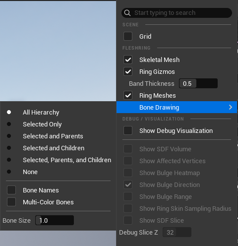

Access these options via the viewport toolbar menu in the FleshRing Asset Editor.

#### FleshRing Display

| Option | Type | Default | Description |
|--------|------|---------|-------------|
| **Skeletal Mesh** | bool | true | Show/hide the target skeletal mesh |
| **Ring Gizmos** | bool | true | Show/hide Virtual Ring/Virtual Band mode gizmos (cylindrical/spline wireframes) |
| **Band Thickness** | float | 0.5 | Virtual Band gizmo line thickness |
| **Ring Meshes** | bool | true | Show/hide Ring static meshes |

#### Bone Drawing

| Option | Type | Default | Description |
|--------|------|---------|-------------|
| **Bone Drawing Mode** | enum | All Hierarchy | Controls which bones are displayed |
| **Bone Names** | bool | false | Show bone names in viewport |
| **Multi-Color Bones** | bool | false | Color-code bones for easier identification |
| **Bone Size** | float | 1.0 | Bone visualization size multiplier |

**Bone Drawing Mode Options:**

| Mode | Description |
|------|-------------|
| All Hierarchy | Display all bones in the skeleton |
| Selected Only | Display only the currently selected bone |
| Selected and Parents | Display selected bone and its parent chain |
| Selected and Children | Display selected bone and its child bones |
| Selected, Parents, and Children | Display selected bone with full parent/child hierarchy |
| None | Hide all bones |

### Debug Visualization

Access these options via the viewport **Show** menu (top-left dropdown) → Debug / Visualization section, or use keyboard shortcuts.

> **Note:** All debug features are editor-only and stripped from packaged builds.

| Option | Shortcut | Description | When to Use |
|--------|:--------:|-------------|-------------|
| **Show Debug Visualization** | `1` | Master toggle for all debug visuals | Enable first to access other options |
| **Show SDF Volume** | `2` | Ring mesh influence bounds (box wireframe). <br />Mesh Based mode only. | Verify influence bounds cover target area |
| **Show Affected Vertices** | `3` | Displays vertices affected by Tightness. <br />Color: Blue(0) → Green(0.5) → Red(1.0) | Verify which vertices receive Tightness |
| **Show Bulge Heatmap** | `4` | Displays vertices affected by Bulge with intensity colors. <br />Color: Cyan(0) → Magenta(1.0) | Verify Bulge intensity distribution |
| **Show Bulge Direction** | `Ctrl+4` | Arrows showing Bulge direction at Ring center. <br />MeshBased/VirtualRing only. | Verify configured Bulge direction |
| **Show Bulge Range** | `Shift+4` | Bulge influence area wireframe. <br />Shape: cylinder (Taper=0), cone (Taper≠0) | Verify Bulge area coverage |
| **Show Ring Skin Sampling Radius** | `5` | Displays skin sampling radius spheres at Ring vertices. <br />Used for Skinned Ring Mesh bone weight sampling. | Verify bone weight sampling coverage |
| **Show SDF Slice** | `Ctrl+2` | 2D cross-section of Ring mesh volume. <br />Color: Blue=inside, Black=surface, Red=outside | Inspect mesh boundary quality |
| **Debug Slice Z** | — | Height level for SDF slice (0~63) | Navigate through slice levels |

**Dependency Hierarchy:**
```
Show Debug Visualization (master)
├── Show SDF Volume
├── Show Affected Vertices
├── Show Bulge Heatmap
│   └── Show Bulge Direction
├── Show Bulge Range
├── Show Ring Skin Sampling Radius
└── Show SDF Slice
    └── Debug Slice Z
```

**Typical Debug Workflow:**

1. Enable **Show Debug Visualization** (`1`)
2. Enable **Show Affected Vertices** (`3`) → verify Tightness vertex coverage
3. Enable **Show Bulge Heatmap** (`4`) → verify Bulge intensity distribution
4. Enable **Show Bulge Range** (`Shift+4`) → adjust Bulge area while observing heatmap

> **Mesh Based mode:** Use **Show SDF Volume** (`2`) to check if bounds cover target area (adjust `Effect Bounds Expand X/Y` if needed). Use **Show SDF Slice** (`Ctrl+2`) to inspect SDF internal quality.

**Related Parameters Quick Reference:**

| Debug Option | Key Parameters to Adjust |
|--------------|--------------------------|
| Show SDF Volume | `Ring Mesh`, `Mesh Offset/Rotation/Scale`, `Effect Bounds Expand X/Y` |
| Show Affected Vertices | `Tightness Strength`, `Tightness Falloff` |
| Show Bulge Heatmap | All Bulge parameters (Deformation > Bulge section) |
| Show Bulge Range | `Bulge Axial Range`, `Bulge Radial Range`, `Bulge Radial Taper` |
| Show Ring Skin Sampling Radius | `Ring Skin Sampling Radius` |

**Visual Examples:**

| Show Affected Vertices | Show Bulge Heatmap |
|:----------------------:|:------------------:|
| 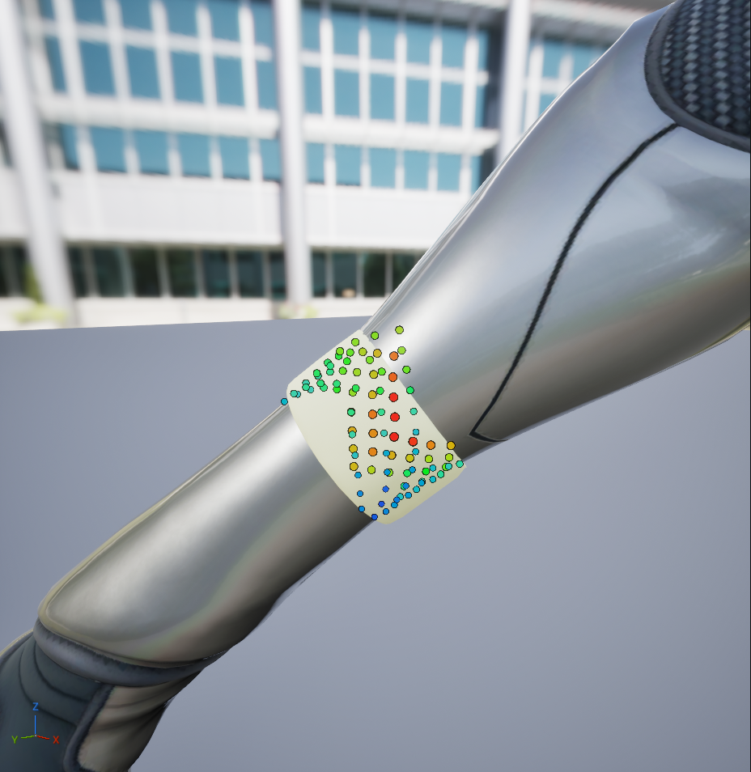 | 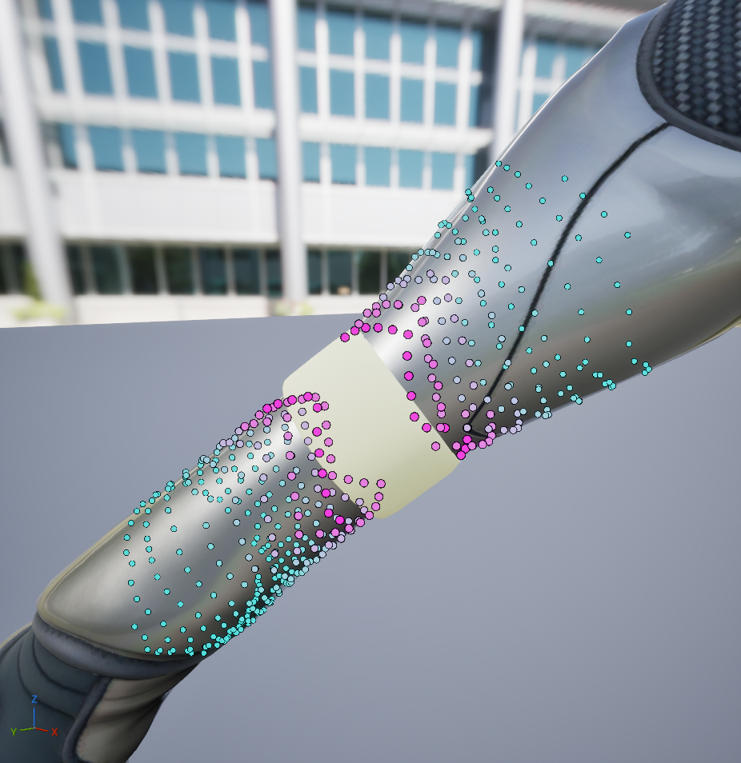 |
| Blue(0) → Green(0.5) → Red(1.0) | Cyan(0) → Magenta(1.0) |

| Show SDF Volume | Show SDF Slice | Show Bulge Range |
|:---------------:|:--------------:|:----------------:|
| 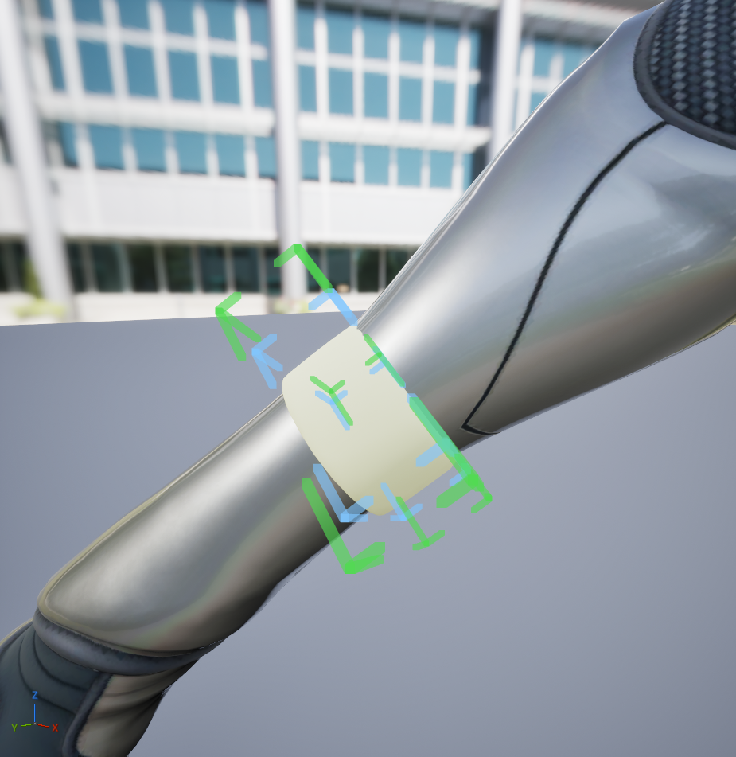 |  | 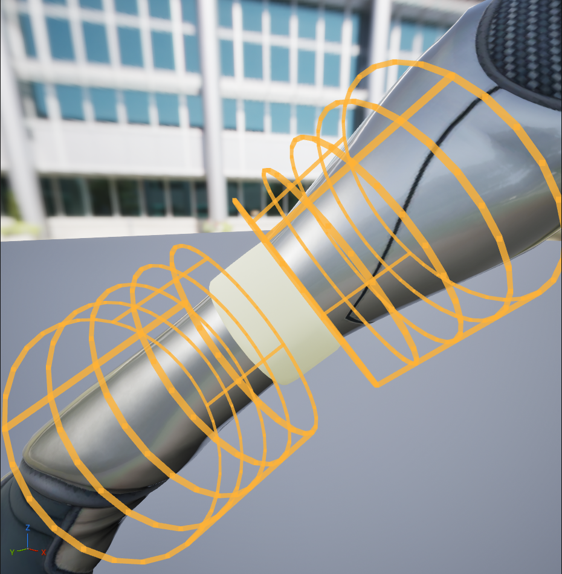 |
| Influence bounds wireframe | Blue=inside, Black=surface, Red=outside | Cylinder/Cone wireframe |

**Parameter Impact (GIF):**

|                     Effect Bounds Expand                     |                    Bulge Parameter Tuning                    |
| :----------------------------------------------------------: | :----------------------------------------------------------: |
|  |  |
| `Effect Bounds Expand X/Y`: 0 → Expand <br/>with SDF Volume + Affected Vertices | Adjusting Bulge parameters <br/>with Bulge Heatmap + Bulge Range |

### Log Categories

Check **Output Log** with these filters:
- `LogFleshRing` - Core deformation pipeline and general messages
- `LogFleshRingComponent` - Component lifecycle and runtime behavior
- `LogFleshRingAsset` - Asset loading, saving, and baking operations

---

## Blueprint & C++ API

### Key Component Functions

> **Note:** This section covers the **standard workflow** where a single FleshRingComponent is attached to a SkeletalMeshComponent.
> For modular characters (Leader Pose / Copy Pose, Skeletal Merging), see [Modular Character API](#modular-character-api).

#### UFleshRingComponent

```cpp
// Hot-swap to a different FleshRing Asset at runtime
// - Requires BakedMesh
// - Pass nullptr to restore original mesh
// - Animation state is preserved during swap
UFUNCTION(BlueprintCallable, Category = "FleshRing")
void SwapFleshRingAsset(UFleshRingAsset* NewAsset);

// Check if using baked mesh at runtime
UFUNCTION(BlueprintPure, Category = "FleshRing")
bool IsUsingBakedMesh() const;

// Get resolved SkeletalMeshComponent that deformation is applied to
// Useful for Modular Character system integration
UFUNCTION(BlueprintPure, Category = "FleshRing")
USkeletalMeshComponent* GetResolvedTargetMesh() const;
```

### Blueprint Example

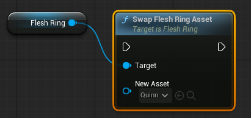

### C++ Setup Example

```cpp
// In your Character class constructor
UFleshRingComponent* FleshRingComp = CreateDefaultSubobject<UFleshRingComponent>(TEXT("FleshRing"));
FleshRingComp->SetupAttachment(GetMesh());

// Runtime equipment swap
void AMyCharacter::OnEquipmentChanged(UFleshRingAsset* NewAsset)
{
    if (FleshRingComp)
    {
        // Pass nullptr to restore original mesh
        FleshRingComp->SwapFleshRingAsset(NewAsset);
    }
}
```

### Modular Character API

All modular character functions are provided via `UFleshRingModularLibrary` (Blueprint Function Library).

#### UFleshRingModularLibrary

##### SwapModularRingAsset (Leader Pose / Copy Pose)

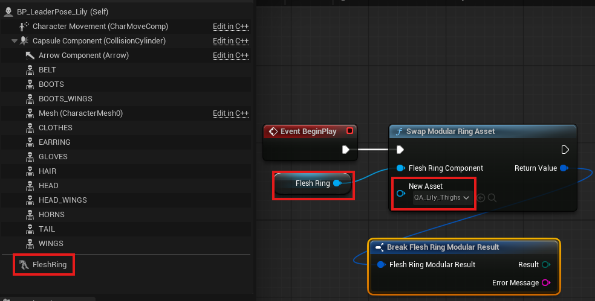

Swaps ring asset on a modular part at runtime.

```cpp
UFUNCTION(BlueprintCallable, Category = "FleshRing|Modular|Leader Pose")
static FFleshRingModularResult SwapModularRingAsset(
    UFleshRingComponent* FleshRingComponent,
    UFleshRingAsset* NewAsset);
```

| Parameter | Type | Description |
|-----------|------|-------------|
| `FleshRingComponent` | `UFleshRingComponent*` | Target FleshRingComponent |
| `NewAsset` | `UFleshRingAsset*` | New ring asset (`nullptr` = remove effect, restore original mesh) |

**Behavior:**
- Requires `BakedMesh` to be present on the new asset
- Pass `nullptr` to remove ring effect and restore original mesh
- Works with both Leader Pose and Copy Pose setups

##### SwapModularPartMesh (Leader Pose / Copy Pose)

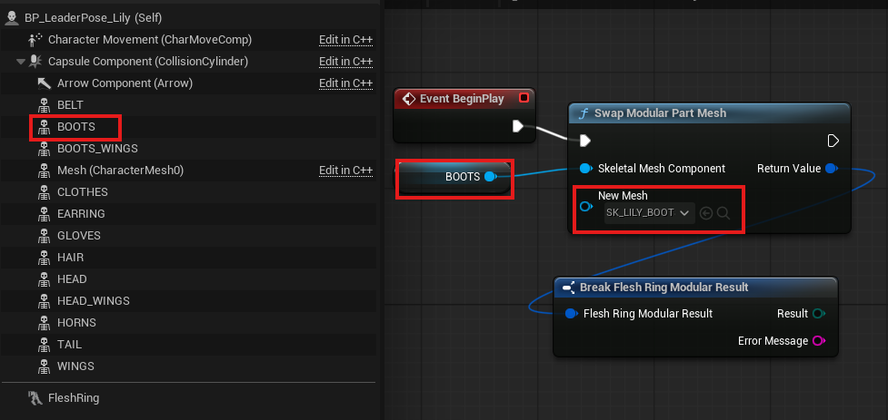

Swaps skeletal mesh on a modular part with ring cleanup.

```cpp
UFUNCTION(BlueprintCallable, Category = "FleshRing|Modular|Leader Pose")
static FFleshRingModularResult SwapModularPartMesh(
    USkeletalMeshComponent* SkeletalMeshComponent,
    USkeletalMesh* NewMesh);
```

| Parameter | Type | Description |
|-----------|------|-------------|
| `SkeletalMeshComponent` | `USkeletalMeshComponent*` | Target component to swap mesh on |
| `NewMesh` | `USkeletalMesh*` | New modular part mesh (must use same skeleton) |

**Behavior:**

- Detaches ring asset effect before applying new mesh
- Validates skeleton compatibility
- Works with both Leader Pose and Copy Pose setups

**FFleshRingModularResult Structure (shared by swap functions):**

| Property | Type | Description |
|----------|------|-------------|
| `Result` | `EFleshRingModularResult` | `Success`, `InvalidComponent`, `InvalidMeshComponent`, `NoBakedMesh`, `TargetMeshNotResolved`, `SkeletonMismatch`, `NoOwner` |
| `ErrorMessage` | `FString` | Error details (populated on failure) |

##### RebuildMergedMesh (Skeletal Merging)

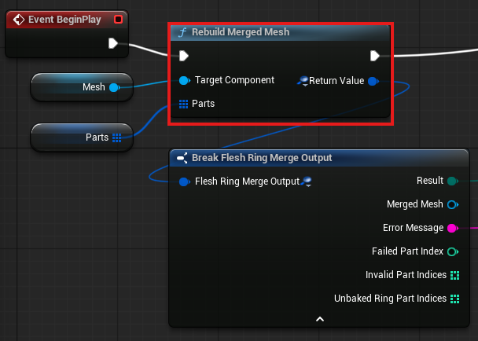

Merges modular parts into a single skeletal mesh.

```cpp
UFUNCTION(BlueprintCallable, Category = "FleshRing|Modular|Skeletal Merging")
static FFleshRingMergeOutput RebuildMergedMesh(
    USkeletalMeshComponent* TargetComponent,
    const TArray<FFleshRingModularPart>& Parts);
```

| Parameter | Type | Description |
|-----------|------|-------------|
| `TargetComponent` | `USkeletalMeshComponent*` | Target component to apply result (`nullptr` = only create mesh) |
| `Parts` | `TArray<FFleshRingModularPart>` | Array of modular parts to merge |

**FFleshRingModularPart Structure:**

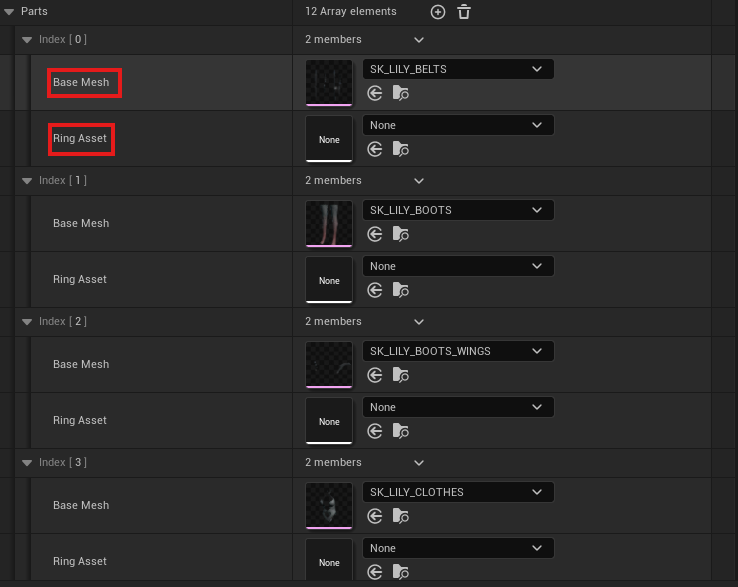

| Property | Type | Description |
|----------|------|-------------|
| `BaseMesh` | `USkeletalMesh*` | Base mesh for this part (required) |
| `RingAsset` | `UFleshRingAsset*` | Optional ring asset (`nullptr` = no ring effect) |

**FFleshRingMergeOutput Structure:**

| Property | Type | Description |
|----------|------|-------------|
| `Result` | `EFleshRingMergeResult` | `Success`, `NoValidParts`, `SkeletonMismatch`, `BakingFailed`, `MergeFailed` |
| `MergedMesh` | `USkeletalMesh*` | Generated merged mesh (valid on success) |
| `ErrorMessage` | `FString` | Error details (populated on failure) |
| `InvalidPartIndices` | `TArray<int32>` | Parts excluded due to null `BaseMesh` |
| `UnbakedRingPartIndices` | `TArray<int32>` | Parts using `BaseMesh` because `RingAsset` has no `BakedMesh` |

**Behavior:**
- Skeleton is extracted from the first valid part automatically
- Invalid parts (null `BaseMesh`) are excluded with warning
- Parts with `RingAsset` but no `BakedMesh` use `BaseMesh` with warning
- Ring visuals are automatically set up on the merged result

#### C++ Example: Leader Pose / Copy Pose Setup

```cpp
// Character with modular parts using Leader Pose / Copy Pose
UCLASS()
class AModularCharacter : public ACharacter
{
    GENERATED_BODY()

public:
    UPROPERTY(VisibleAnywhere)
    TObjectPtr<USkeletalMeshComponent> LegsMesh;

    UPROPERTY(VisibleAnywhere)
    TObjectPtr<UFleshRingComponent> LegsRingComp;

    AModularCharacter()
    {
        // Leader mesh (body) - uses default GetMesh()

        // Follower mesh (legs)
        LegsMesh = CreateDefaultSubobject<USkeletalMeshComponent>(TEXT("LegsMesh"));
        LegsMesh->SetupAttachment(GetMesh());
        LegsMesh->SetLeaderPoseComponent(GetMesh());

        // Ring component for legs (FleshRingAsset set via Blueprint or EquipStocking())
        LegsRingComp = CreateDefaultSubobject<UFleshRingComponent>(TEXT("LegsRing"));
        LegsRingComp->SetupAttachment(LegsMesh);
    }

    // Swap stocking at runtime
    UFUNCTION(BlueprintCallable)
    void EquipStocking(UFleshRingAsset* StockingAsset)
    {
        FFleshRingModularResult Result =
            UFleshRingModularLibrary::SwapModularRingAsset(LegsRingComp, StockingAsset);

        if (!Result.Succeeded())
        {
            UE_LOG(LogTemp, Warning, TEXT("Stocking swap failed: %s"), *Result.ErrorMessage);
        }
    }

    // Swap leg mesh (e.g., different pants)
    UFUNCTION(BlueprintCallable)
    void SwapLegMesh(USkeletalMesh* NewLegMesh)
    {
        FFleshRingModularResult Result =
            UFleshRingModularLibrary::SwapModularPartMesh(LegsMesh, NewLegMesh);

        if (!Result.Succeeded())
        {
            UE_LOG(LogTemp, Warning, TEXT("Leg mesh swap failed: %s"), *Result.ErrorMessage);
        }
    }
};
```

#### C++ Example: Skeletal Merging

```cpp
void AMyCharacter::BuildModularCharacter()
{
    TArray<FFleshRingModularPart> Parts;

    // Body part (no ring)
    FFleshRingModularPart BodyPart;
    BodyPart.BaseMesh = BodySkeletalMesh;
    Parts.Add(BodyPart);

    // Legs with stocking ring
    FFleshRingModularPart LegsPart;
    LegsPart.BaseMesh = LegsSkeletalMesh;
    LegsPart.RingAsset = StockingRingAsset;  // Must have BakedMesh
    Parts.Add(LegsPart);

    // Merge and apply
    FFleshRingMergeOutput Output =
        UFleshRingModularLibrary::RebuildMergedMesh(GetMesh(), Parts);

    if (Output.Succeeded())
    {
        // Check for warnings
        if (Output.HasUnbakedRingParts())
        {
            UE_LOG(LogTemp, Warning, TEXT("Some ring assets have no BakedMesh"));
        }
    }
    else
    {
        UE_LOG(LogTemp, Error, TEXT("Merge failed: %s"), *Output.ErrorMessage);
    }
}
```

#### Important Notes

| Topic | Details |
|-------|---------|
| **Skeleton Compatibility** | All parts must use the same `USkeleton`. Mismatched skeletons will fail with `SkeletonMismatch` error. |
| **BakedMesh Requirement** | Ring effects only work with baked deformation. Call `Bake` in the Asset Editor first. |
| **Pose Setup Preservation** | Swap functions automatically preserve Leader Pose / Copy Pose setup. No manual reconfiguration needed. |
| **Error Handling** | Always check `Result.Succeeded()` and handle failures gracefully. |
| **Performance** | Skeletal Merging has high rebuild cost. Use Leader Pose / Copy Pose for frequent runtime changes. |

---

## Performance Guide

### Runtime Performance

Baked workflow = **zero runtime GPU cost**. Deformation is pre-computed and stored in the mesh.

| Scenario | GPU Cost |
|----------|----------|
| Baked mesh (normal use) | **0 ms** |
| Editor preview (real-time) | 0.5~2 ms |

### Best Practices

1. **Always bake** for production builds—zero runtime deformation cost
2. **Virtual Ring** (cylindrical) and **Virtual Band** (variable radius for stockings) modes work without separate ring meshes. Use **Mesh Based (SDF)** mode for complex decorative shapes.
3. **Use Exclude layer type** for materials that don't need deformation (eyes, hair)

---

## Troubleshooting & FAQ

### Frequently Asked Questions

**Q: Why don't I see any deformation in PIE (Play in Editor)?**
A: You need to click **"Bake"** in the Asset Editor. Editor preview and runtime use different systems—the baked mesh is required for runtime.

**Q: Can I use this for real-time cloth simulation?**
A: No. FleshRing is designed for static/baked deformations. For dynamic cloth, use Unreal's built-in Cloth system or Chaos Cloth.

**Q: Can I use this on NPCs/AI characters?**
A: Yes. Since baked meshes have zero runtime cost, you can use FleshRing on any number of characters.

**Q: Why is my mesh collapsing/shrinking?**
A: Enable **Enable Edge Length Preservation** and increase **Constraint Iterations**. If **Smoothing Iterations** is high, change **Smoothing Type** from Standard to **Volume Preserving**.

**Q: My skin and stocking are crossing through each other. How do I fix this?**
A: Use **Target Material Layers** to control which layers receive Tightness:
- Option 1: Enable only Skin in the mask (skin deforms, stocking stays at original position)
- Option 2: Enable only Stocking in the mask (stocking deforms, skin stays at original position)

> ⚠️ **Limitation:** Enabling both Skin and Stocking in the mask may cause intersection artifacts when stocking vertices overlap directly with skin vertices.

**Q: How do I exclude eyes/hair from deformation?**
A: In Material Layer Mappings, set those material slots to **Exclude** layer type. They will never be affected regardless of Target Material Layers setting.

**Q: Is there a limit on the number of Rings per asset?**
A: No hard limit. However, more Rings increase editor preview computation time.

### Common Issues

| Issue | Cause | Solution |
|-------|-------|----------|
| No deformation at runtime | Bake not generated | Click "Bake" in Asset Editor |
| Deformation looks different at runtime | Outdated bake | Rebake after any parameter change |
| Mesh spikes/artifacts | Non-manifold geometry or extreme settings | Reduce tightness, enable smoothing |
| Ring not following bone | Wrong bone selected | Use Asset Editor bone tree to verify |
| Skin/stocking crossing | Layer penetration limitation | Use Target Material Layers to exclude one layer |
| Slow editor preview | High subdivision or smoothing settings | Reduce Preview Subdivision Level, Smoothing Iterations, Max Smoothing Depth |
| Black/corrupted mesh | GPU shader compilation failed | Restart editor, verify GPU drivers |
| Eyes/hair deforming | Wrong layer type | Set those materials to Exclude |

---

## Support & Contact

### Getting Help

| Resource | Link |
|----------|------|
| **Documentation** | Included in `Docs/` folder |
| **Email Support** | kraftontechlablcg@gmail.com |
| **Bug Reports** | Submit via FAB product page or email |

### Before Contacting Support

Please include:
1. Unreal Engine version
2. FleshRing Plugin version
3. Steps to reproduce the issue
4. Relevant log output (`LogFleshRing`)
5. Screenshot or video if visual issue

---

## License

MIT License — Free for personal and commercial use.

Distributed through FAB Marketplace.

---

## Credits

**Developer:** LgThx
**Engine:** Unreal Engine 5.7

---

*Thank you for choosing FleshRing! We hope this plugin helps bring your characters to life.*
