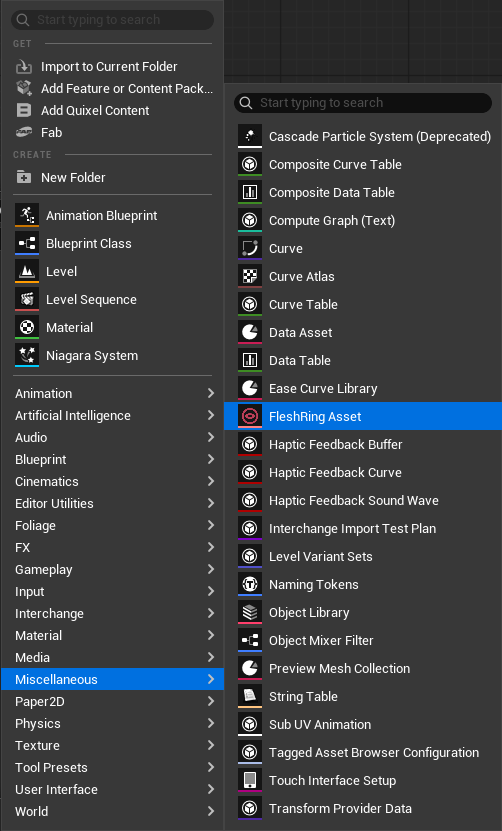
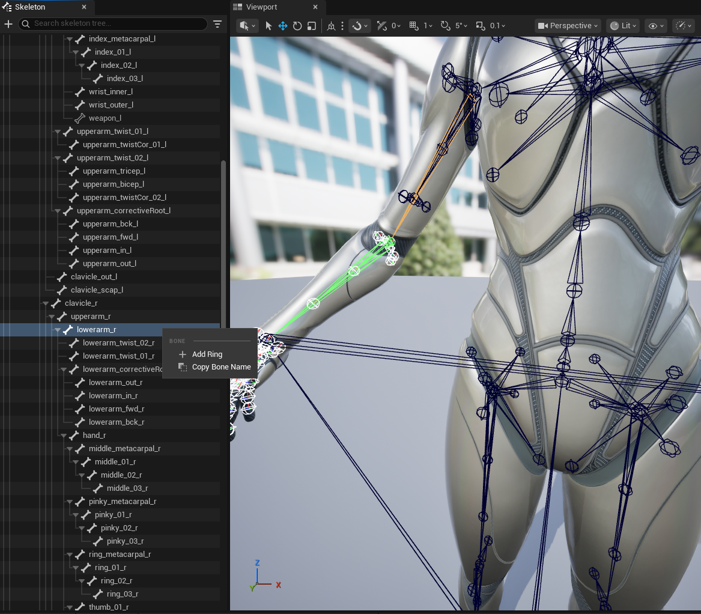
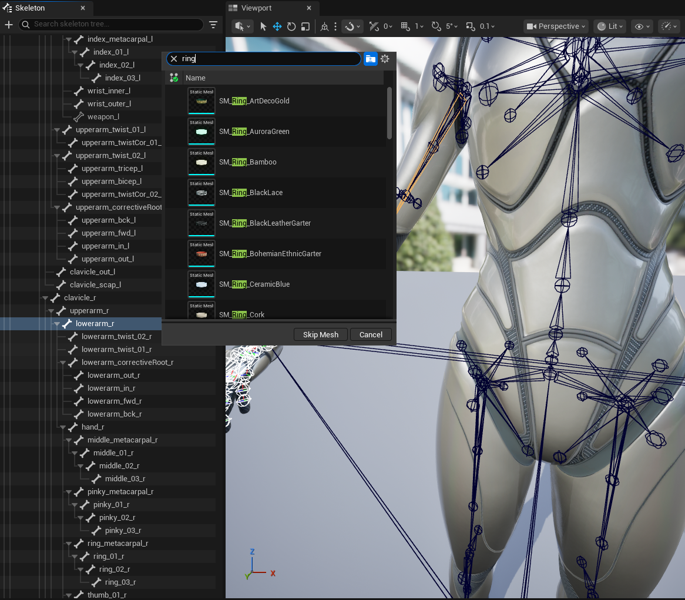
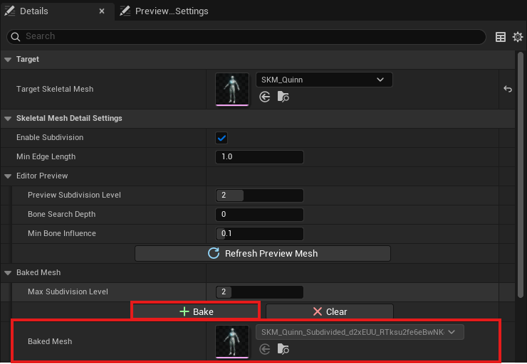

# FleshRing Plugin

 

> **Unreal Engine 5.7을 위한 GPU 가속 살 압착 시뮬레이션 플러그인**

FleshRing은 밴드, 스트랩, 가터벨트, 스타킹 등 조이는 오브젝트가 캐릭터 메시를 누를 때 발생하는 사실적인 피부 변형을 구현합니다. Compute Shader와 Signed Distance Field(SDF)를 활용하여 베이크 기반 워크플로우로 런타임 비용 없이 프로덕션 퀄리티의 결과물을 제공합니다.

---

## 주요 기능

- **베이크 기반 워크플로우** — 에디터에서 디자인하고, 런타임 GPU 비용 없이 배포
- **SDF 기반 변형** — 실제 링 메시 형태에 맞는 정밀한 압착 효과
- **조임 & 불룩함 효과** — 자연스러운 살 밀림과 함께 사실적인 압착 표현
- **고급 스무딩** — Laplacian, Taubin, PBD 제약 조건으로 아티팩트 없는 결과물
- **머티리얼 레이어 제어** — 레이어 마스킹을 통한 머티리얼별 포함/제외 설정
- **다중 링 지원** — 에셋당 무제한 압착 포인트 지원
- **가상 링/밴드 모드** — 커스텀 메시 없이 빠른 설정 가능
- **모듈러 캐릭터 지원** — UE 모듈러 스켈레탈 메시 시스템과 호환
- **실시간 에디터 프리뷰** — 편집 중 GPU 기반 즉각적인 피드백
- **전용 에셋 에디터** — 3D 뷰포트, 트랜스폼 기즈모, 스켈레톤 본 트리
- **Blueprint & C++ API 완벽 지원** — 런타임 에셋 교체 가능

---

## FAB에서 다운로드

FAB 마켓플레이스에서 다운로드하세요:
👉 [FAB에서 FleshRing 보기](https://www.fab.com/ko/portal/listings/4aa9ceae-7c7d-4e70-b6fb-3d5f28dcf2f6/preview)

---

## 요구 사항

| | |
|---|---|
| **엔진** | Unreal Engine 5.7 |
| **플랫폼** | Windows 64-bit (Win64) |
| **GPU** | Compute Shader 지원 (SM 5.0+) |

---

## 설치 방법

1. **프로젝트 루트 폴더** 찾기 (`YourProject.uproject` 파일이 있는 위치)
2. `Plugins` 폴더가 없다면 **생성**
3. `FleshRingPlugin` 폴더를 `Plugins/`에 **복사**
4. 언리얼 에디터 실행 → `Edit → Plugins` → **FleshRing** 활성화
5. 프롬프트가 나타나면 에디터 **재시작**

---

## 빠른 시작

1. **에셋 생성:** 콘텐츠 브라우저 우클릭 → `기타 → FleshRing Asset`
    

2. **타겟 설정:** 디테일 패널 → **Target** 카테고리 → **Target Skeletal Mesh** 설정

3. **링 추가:** 스켈레톤 트리 패널 → 본 우클릭 → `Add Ring to [BoneName]`
    

    

4. **설정 조정:** 디테일 패널 → **Ring** 카테고리 → **Tightness Strength**, **Bulge Intensity** 조절

5. **베이크:** 툴바 → **"Bake"** 버튼 클릭 (런타임 사용 시 필수!)
    

    > **중요:** 베이크하지 않으면 에디터 프리뷰가 런타임에 나타나지 않습니다.

6. **적용:** 캐릭터 블루프린트에 **Flesh Ring** 컴포넌트 추가 ("FleshRing" 검색) → **Flesh Ring Asset** 설정

### 결과

---

## 문서

상세한 파라미터 레퍼런스, 튜토리얼, 트러블슈팅은 아래 문서를 참조하세요:

**[전체 기술 문서](Docs/FleshRing_Documentation.md)**

---

## 지원

| | |
|---|---|
| **문서** | `Docs/FleshRing_Documentation.md` 참조 |
| **이메일** | kraftontechlablcg@gmail.com |
| **버그 리포트** | FAB 제품 페이지에서 제출 |

---

## 라이선스

MIT License — 개인 및 상업적 사용 무료.

FAB 마켓플레이스를 통해 배포됩니다.

---

## 크레딧

**KRAFTON Jungle GameTech Lab Season 2 × Epic Games Project**

**Developed by Team LgThx**
